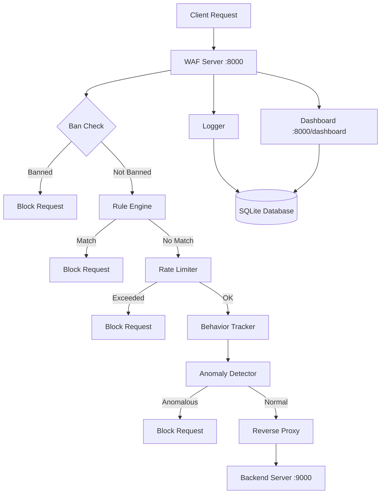

# Intelligent Reverse Proxy Web Application Firewall

This application implements a reverse-proxy-based Web Application Firewall (WAF) that intercepts HTTP requests, applies layered security checks, and forwards safe traffic to a backend server. It provides logging, metrics collection, and a web-based dashboard for monitoring security events.

## Architecture

The system consists of three main components: a vulnerable backend application for testing, the WAF server that performs security analysis, and a SQLite database for storing logs and ban records. Client requests flow through the WAF server which applies multiple security layers before proxying legitimate requests to the backend.



## Request Flow

When a request arrives at the WAF server, it undergoes a sequential security pipeline. The system first checks if the originating IP is banned, blocking immediately if so. Non-banned requests are inspected by the rule engine for attack patterns including SQL injection, XSS, and command injection. Matching requests are blocked and the IP is banned.

Requests passing rule-based inspection proceed to rate limiting using a sliding window algorithm. Exceeding the threshold results in blocking and IP banning. Surviving requests are analyzed by the behavior tracker, which extracts features including requests per minute, URI entropy, payload size, header count, and error response ratio. These features are fed into an IsolationForest-based anomaly detector that compares behavior against normal traffic baselines. Anomalous requests are blocked.

Only requests passing all security checks are forwarded to the backend server via HTTPX, preserving HTTP method, headers, and body content. All requests are logged to SQLite with timestamps, IP addresses, paths, decisions, and reasons.

## Security Components

The rule-based inspector loads attack signatures from a YAML configuration file, using pattern matching against URL paths, query parameters, and request bodies. The rate limiter implements per-IP sliding window tracking, defaulting to 10 requests per 10 seconds. The behavior tracker maintains in-memory feature vectors per IP address, calculating metrics over rolling time windows.

The anomaly detector uses scikit-learn's IsolationForest algorithm, an unsupervised learning model trained on synthetic baseline data representing normal traffic patterns. The behavior tracker extracts five features from each request: requests per minute, URI entropy, payload size, header count, and error response ratio. These features are scored by the IsolationForest model, which returns an anomaly score indicating deviation from normal patterns. Requests exceeding the configured threshold are blocked. This ML-based approach complements rule-based detection by identifying behavioral anomalies that may not match known attack signatures.

The ban manager stores IP bans in SQLite with expiration timestamps, checked before any other security processing. Ban durations default to 300 seconds and are configurable. The logging system writes structured JSON logs to both console output and SQLite database.

## Installation and Setup

The application requires Python 3.10 or higher. Follow these steps to set up both components.

**Step 1: Setup Backend**

```bash
cd backend
python -m venv venv
source venv/bin/activate
pip install fastapi uvicorn python-multipart
```

**Step 2: Setup WAF**

```bash
cd waf
python -m venv venv
source venv/bin/activate
pip install -r requirements.txt
```

**Step 3: Run Backend Server (Terminal 1)**

```bash
cd backend
source venv/bin/activate
uvicorn app:app --host 0.0.0.0 --port 9000
```

**Step 4: Run WAF Server (Terminal 2)**

```bash
cd waf
source venv/bin/activate
uvicorn app.main:app --host 0.0.0.0 --port 8000 --reload
```

## Accessing the Dashboard

Once both servers are running, access the web dashboard at http://localhost:8000/dashboard. The dashboard displays four visualizations: traffic over time, allowed versus blocked requests, attack type distribution, and top IP offenders. A recent logs section shows the latest request entries. The dashboard auto-refreshes every five seconds.

## Testing the WAF

Test normal requests by sending HTTP requests to the WAF server. Legitimate requests should be proxied successfully. Test attack detection by sending requests containing SQL injection patterns, XSS patterns, or command injection patterns. These should be blocked with 403 status codes. Test rate limiting by sending multiple requests rapidly from the same IP address, which should trigger 429 responses after exceeding the threshold. Test anomaly detection by sending requests with unusual patterns such as high request rates or abnormal payload sizes.

Comprehensive test scripts are provided in test_waf.sh and test_waf.py. Run the Python test script for detailed output.

```bash
python3 test_waf.py
```

## Configuration

The WAF behavior is configured through config.yaml. The backend_url specifies where legitimate requests are forwarded. Rate limiting thresholds are set via rate_limit.requests and rate_limit.per_seconds. Anomaly detection can be enabled or disabled via anomaly.enabled, with sensitivity controlled by anomaly.threshold. Ban durations are set through ban.duration_seconds.

Security rules are defined in rules/owasp_rules.yaml, containing pattern-based detection rules for various attack types. Rules can be added or modified to expand detection capabilities.

## Project Structure

The application is organized into modular components. The app directory contains the main WAF implementation with middleware components including rule engine, rate limiter, behavior tracker, anomaly detector, and ban manager. The logging directory contains database models and logging utilities. The dashboard directory includes route handlers and HTML templates. The utils directory provides helper functions. The backend directory contains the vulnerable test application.

## API Endpoints

The WAF server operates as a reverse proxy, forwarding all non-dashboard requests to the backend server after security checks. Any HTTP method is supported including GET, POST, PUT, DELETE, PATCH, and OPTIONS. Requests are forwarded to the backend with original headers, body content, and query parameters preserved.

**Backend Endpoints (via WAF proxy):**

All backend endpoints are accessible through the WAF at http://localhost:8000/{path}. The test backend provides the following endpoints:

- `GET /search?q={query}` - Search endpoint that returns search results
- `POST /login` - Login endpoint accepting username and password form data
- `GET /admin` - Admin endpoint that returns 403 forbidden

These endpoints can be accessed directly through the WAF proxy, which will apply security checks before forwarding legitimate requests. Attack patterns in requests to these endpoints will be blocked by the WAF.

**Dashboard Endpoints:**

The dashboard provides monitoring and analytics endpoints. Access all endpoints at http://localhost:8000:

- `GET /dashboard` - Main dashboard HTML page with visualizations (use this in browser)
- `GET /dashboard/logs` - JSON endpoint returning recent request logs (returns JSON array)
- `GET /dashboard/metrics` - JSON endpoint returning decision counts (returns JSON object)
- `GET /dashboard/traffic` - JSON endpoint returning traffic over time data (returns JSON object)
- `GET /dashboard/attacks` - JSON endpoint returning attack type distribution (returns JSON object)
- `GET /dashboard/top_ips` - JSON endpoint returning top IP offenders (returns JSON object)
- `GET /dashboard/bans` - JSON endpoint returning active IP bans (returns JSON array)

Note: All dashboard endpoints except `/dashboard` return JSON data. Use `/dashboard` in your browser for the visual interface, or use the JSON endpoints programmatically with curl or API clients.
